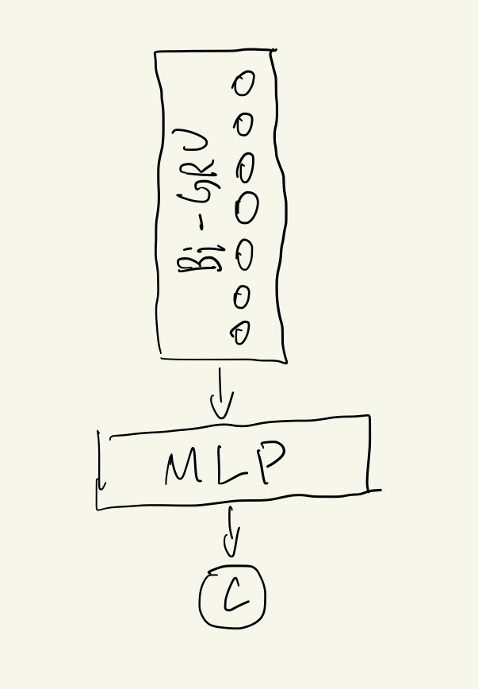

For games, especially in free-to-play online games, it's very important to predict users' behaviors, such as their play-time, shopping cart preference, or churn probability and so on.  Most online games need servers to sychronize users information, so it's very easy to record, store and process user behavior data on server side, which needs sdk to record logs, data warehouse to store data and big-data suite to process information. 

My major job is to predict user behaior based on these infractures, metention above. In this blog, I will share a series of models to show the effectiveness of temporal features in games. The task is to predict whether user will churn 7 days after registering, which is a binary classification problem. The data are user actions, distributed in decades of tables, such as login table, purchase table, play-round table , etc. We use AUC to evaluate the effectiveness of models.

## Model 1: Bi-RSU

As we want to make use of temporal data, the first model is a simple Bi-directional GRU, short for Bi-GRU, model. Every time, a user logouts the game, it records the play-time of the user during this session. The Bi-GRU takes the logout play-time series and aggregates the temporal information. Then, a MLP layer is appended to discriminate the final objective, churn or not, as shown below.

The AUC for Bi-GRU is **0.773**. The total sample size is about 600,000, and churn rate is about 60%. The result is not bad, bue we want to get better result.

## Model 2: Model 1 plus more features

## Model 3: Model 2 plus feature rescaling

## Model 4: XGBoost with features engineering

## Model 5: Model 3 plus Model 4

## Model 6: Model 5 plus different embedding series 

## Summary

We have run 6 models, and gained lift step by step. The improved auc shows that temporal data can add extra information, campared with only aggregated features, to make the model more accurate. Of course, we need more experiemnts to demostrate the generalizability the effectiveness. This experiment give us some inspiration and we will follow up and apply it in the real world problem in the future.

